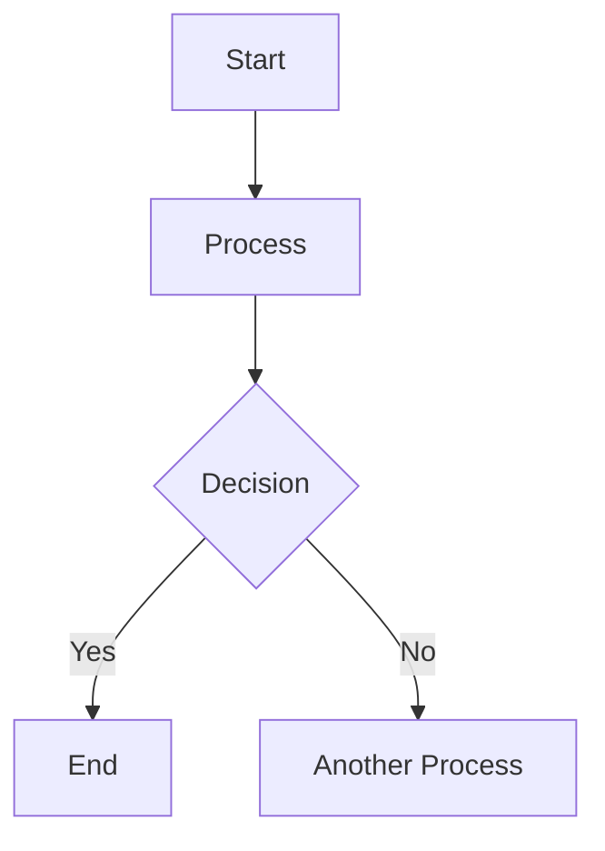

# Table of Content

- [Table of Content](#table-of-content)
  - [Tables](#tables)
  - [Indecies](#indecies)
  - [Database Diagram (test mermaid)](#database-diagram-test-mermaid)

---

## Tables

- Users
- Addresses
- Categories
- Products
- ProductCategories
- ProductImages
- ShoppingCartItems
- Orders
- OrderItems
- Payments
- UserActivity
- ProductReviews

⬆️ [Back](#table-of-content)

## Indecies

- CREATE INDEX idx_users_email ON Users(email);
- CREATE INDEX idx_products_name ON Products(name);
- CREATE INDEX idx_orders_user_id ON Orders(user_id);
- CREATE INDEX idx_productreviews_product_id ON ProductReviews(product_id);
- CREATE INDEX idx_productimages_product_id ON ProductImages(product_id);

⬆️ [Back](#table-of-content)

## Database Diagram (test mermaid)

⬆️ [Back](#table-of-content)
