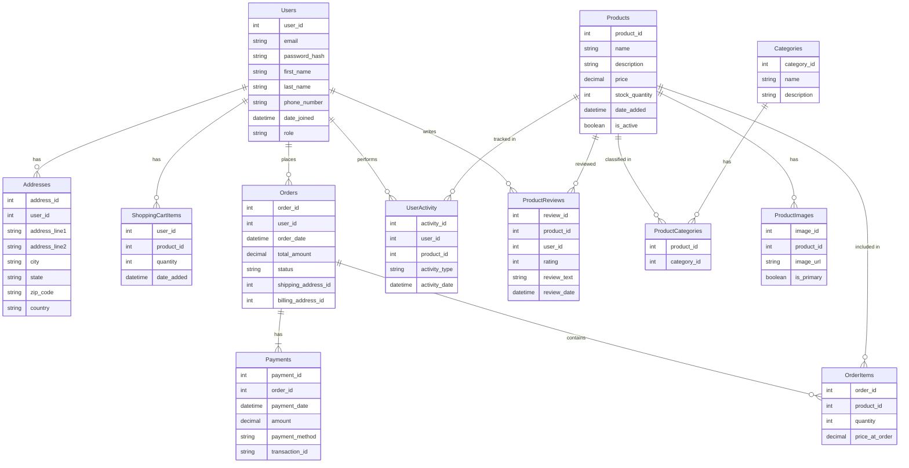

# Table of Content

- [Table of Content](#table-of-content)
  - [Tables](#tables)
  - [Indecies](#indecies)
  - [Database Diagram (mermaid)](#database-diagram-mermaid)
  - [Sql script](#sql-script)

---

## Tables

- Users
- Addresses
- Categories
- Products
- ProductCategories
- ProductImages
- ShoppingCartItems
- Orders
- OrderItems
- Payments
- UserActivity
- ProductReviews

⬆️ [Back](#table-of-content)

## Indecies

- CREATE INDEX idx_users_email ON Users(email);
- CREATE INDEX idx_products_name ON Products(name);
- CREATE INDEX idx_orders_user_id ON Orders(user_id);
- CREATE INDEX idx_productreviews_product_id ON ProductReviews(product_id);
- CREATE INDEX idx_productimages_product_id ON ProductImages(product_id);

⬆️ [Back](#table-of-content)

## Database Diagram (mermaid)



⬆️ [Back](#table-of-content)

## Sql script

```sql
CREATE TABLE Users (
    user_id SERIAL PRIMARY KEY,
    email VARCHAR(255) NOT NULL UNIQUE,
    password_hash VARCHAR(255) NOT NULL,
    first_name VARCHAR(100) NOT NULL,
    last_name VARCHAR(100) NOT NULL,
    phone_number VARCHAR(20),
    date_joined TIMESTAMP NOT NULL DEFAULT CURRENT_TIMESTAMP,
    role VARCHAR(50) NOT NULL DEFAULT 'Customer' CHECK (role IN ('Customer', 'Administrator'))
);

CREATE TABLE Addresses (
    address_id SERIAL PRIMARY KEY,
    user_id INTEGER NOT NULL REFERENCES Users(user_id) ON DELETE CASCADE,
    address_line1 VARCHAR(255) NOT NULL,
    address_line2 VARCHAR(255),
    city VARCHAR(100) NOT NULL,
    state VARCHAR(100) NOT NULL,
    zip_code VARCHAR(20) NOT NULL,
    country VARCHAR(100) NOT NULL
);

CREATE TABLE Categories (
    category_id SERIAL PRIMARY KEY,
    name VARCHAR(100) NOT NULL UNIQUE,
    description TEXT
);

CREATE TABLE Products (
    product_id SERIAL PRIMARY KEY,
    name VARCHAR(255) NOT NULL,
    description TEXT,
    price DECIMAL(10, 2) NOT NULL CHECK (price >= 0),
    stock_quantity INTEGER NOT NULL CHECK (stock_quantity >= 0),
    date_added TIMESTAMP NOT NULL DEFAULT CURRENT_TIMESTAMP,
    is_active BOOLEAN NOT NULL DEFAULT TRUE
);

CREATE TABLE ProductCategories (
    product_id INTEGER NOT NULL REFERENCES Products(product_id) ON DELETE CASCADE,
    category_id INTEGER NOT NULL REFERENCES Categories(category_id) ON DELETE CASCADE,
    PRIMARY KEY (product_id, category_id)
);


CREATE TABLE ProductImages (
    image_id SERIAL PRIMARY KEY,
    product_id INTEGER NOT NULL REFERENCES Products(product_id) ON DELETE CASCADE,
    image_url VARCHAR(2083) NOT NULL,
    is_primary BOOLEAN NOT NULL DEFAULT FALSE
);

CREATE TABLE ShoppingCartItems (
    user_id INTEGER NOT NULL REFERENCES Users(user_id) ON DELETE CASCADE,
    product_id INTEGER NOT NULL REFERENCES Products(product_id),
    quantity INTEGER NOT NULL CHECK (quantity > 0),
    date_added TIMESTAMP NOT NULL DEFAULT CURRENT_TIMESTAMP,
    PRIMARY KEY (user_id, product_id)
);

CREATE TABLE Orders (
    order_id SERIAL PRIMARY KEY,
    user_id INTEGER NOT NULL REFERENCES Users(user_id),
    order_date TIMESTAMP NOT NULL DEFAULT CURRENT_TIMESTAMP,
    total_amount DECIMAL(10, 2) NOT NULL CHECK (total_amount >= 0),
    status VARCHAR(50) NOT NULL,
    shipping_address_id INTEGER NOT NULL REFERENCES Addresses(address_id),
    billing_address_id INTEGER NOT NULL REFERENCES Addresses(address_id)
);

CREATE TABLE OrderItems (
    order_id INTEGER NOT NULL REFERENCES Orders(order_id) ON DELETE CASCADE,
    product_id INTEGER NOT NULL REFERENCES Products(product_id),
    quantity INTEGER NOT NULL CHECK (quantity > 0),
    price_at_order DECIMAL(10, 2) NOT NULL CHECK (price_at_order >= 0),
    PRIMARY KEY (order_id, product_id)
);

CREATE TABLE Payments (
    payment_id SERIAL PRIMARY KEY,
    order_id INTEGER NOT NULL UNIQUE REFERENCES Orders(order_id) ON DELETE CASCADE,
    payment_date TIMESTAMP NOT NULL DEFAULT CURRENT_TIMESTAMP,
    amount DECIMAL(10, 2) NOT NULL CHECK (amount >= 0),
    payment_method VARCHAR(50) NOT NULL,
    transaction_id VARCHAR(255) UNIQUE NOT NULL
);


CREATE TABLE UserActivity (
    activity_id SERIAL PRIMARY KEY,
    user_id INTEGER REFERENCES Users(user_id) ON DELETE SET NULL,
    product_id INTEGER REFERENCES Products(product_id) ON DELETE SET NULL,
    activity_type VARCHAR(50) NOT NULL,
    activity_date TIMESTAMP NOT NULL DEFAULT CURRENT_TIMESTAMP
);

CREATE TABLE ProductReviews (
    review_id SERIAL PRIMARY KEY,
    product_id INTEGER NOT NULL REFERENCES Products(product_id) ON DELETE CASCADE,
    user_id INTEGER NOT NULL REFERENCES Users(user_id) ON DELETE CASCADE,
    rating INTEGER NOT NULL CHECK (rating BETWEEN 1 AND 5),
    review_text TEXT,
    review_date TIMESTAMP NOT NULL DEFAULT CURRENT_TIMESTAMP
);

CREATE INDEX idx_users_email ON Users(email);
CREATE INDEX idx_products_name ON Products(name);
CREATE INDEX idx_orders_user_id ON Orders(user_id);
CREATE INDEX idx_productreviews_product_id ON ProductReviews(product_id);
CREATE INDEX idx_productimages_product_id ON ProductImages(product_id);
```

⬆️ [Back](#table-of-content)
